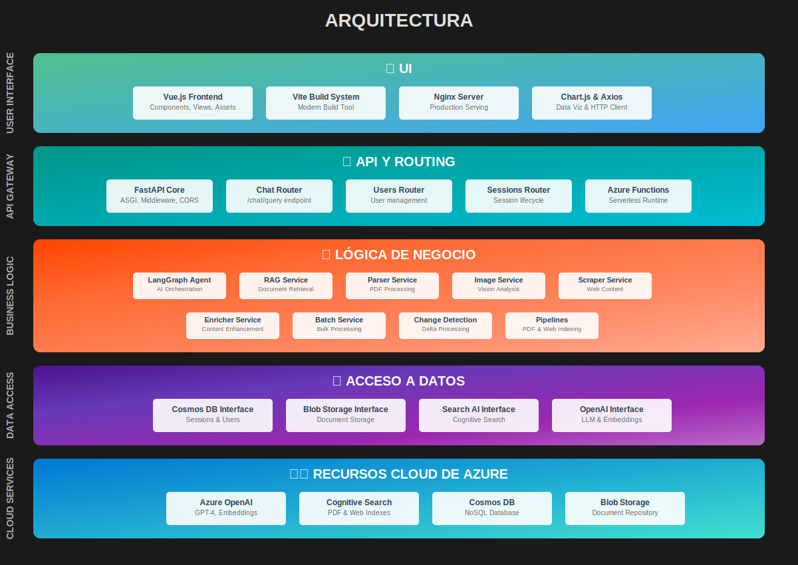
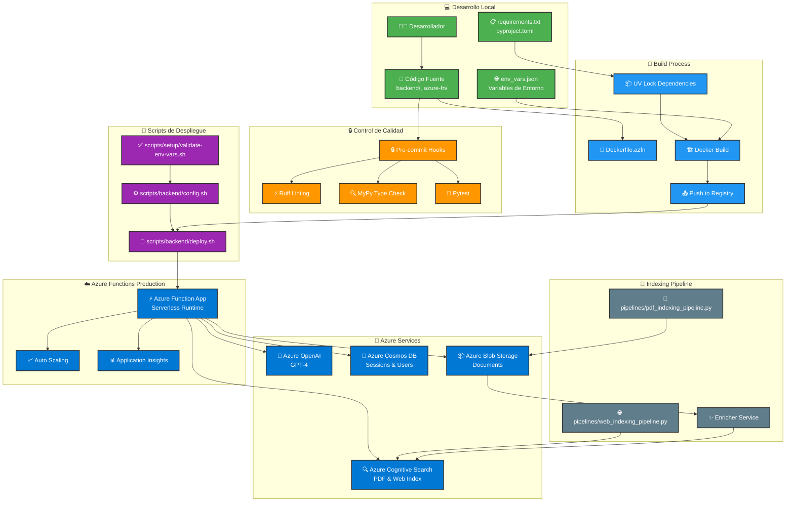

# 🤖 Chatbot Documentación técnica


Se realizó un chatbot de documentación técnica. Utiliza tecnologías de vanguardia como Azure OpenAI, LangGraph y Retrieval-Augmented Generation (RAG) para proporcionar respuestas precisas y contextuales basadas en documentos PDF y contenido web indexado.

## 📋 Tabla de Contenidos

- [🚀 Características Principales](#-características-principales)
- [🏗️ Arquitectura del Proyecto](#️-arquitectura-del-proyecto)
- [🔄 Diagrama de Desarrollo a Producción Azure](#-diagrama-de-desarrollo-a-producción-azure)
- [🏗️ Arquitectura por Capas](#️-arquitectura-por-capas)
- [📁 Estructura Detallada de Directorios](#-estructura-detallada-de-directorios)
- [⚙️ Archivos de Configuración y Desarrollo](#️-archivos-de-configuración-y-desarrollo)
- [🛠️ Stack Tecnológico](#️-stack-tecnológico)
- [📋 Prerrequisitos](#-prerrequisitos)
- [⚙️ Instalación y Configuración](#️-instalación-y-configuración)
- [🚀 Uso](#-uso)
- [📊 Monitoreo y Logging](#-monitoreo-y-logging)
- [🧪 Testing](#-testing)
- [📊 Calidad de Código](#-calidad-de-código)
- [🚢 Despliegue](#-despliegue)
- [🤝 Cómo Contribuir](#-cómo-contribuir)
- [📄 Licencia](#-licencia)
- [📞 Contacto](#-contacto)

## 🚀 Características Principales

- **🤖 Agente Conversacional Inteligente**: Powered by Azure OpenAI y LangGraph para respuestas contextuales
- **📄 Procesamiento Multimodal**: Análisis inteligente de documentos PDF con extracción de texto e imágenes
- **🌐 Indexación Web**: Scraping y indexación automática de contenido web usando ScrapeGraphAI
- **🔍 RAG Pipeline**: Sistema de búsqueda semántica con Azure Cognitive Search
- **👥 Gestión de Usuarios y Sesiones**: Sistema completo de autenticación y manejo de sesiones
- **⚡ Procesamiento Asíncrono**: Pipeline de indexación optimizado con rate limiting
- **🐳 Contenerización Completa**: Despliegue con Docker y Docker Compose
- **☁️ Azure Functions**: Funciones serverless para escalabilidad automática
- **📊 Monitoreo y Logging**: Sistema de logging avanzado con Loguru
- **🔒 Seguridad Empresarial**: Middleware de seguridad y validación de datos

## 🏗️ Estructura del Proyecto

```
chatbot-project/
├── 🔧 backend/                   # API FastAPI con lógica de negocio
├── 🎨 frontend/                  # Interfaz Vue.js responsive
├── ☁️ azure-fn/                  # Azure Functions serverless
├── 🔄 pipelines/                 # Pipelines de indexación automática
├── 🧪 tests/                     # Suite completa de pruebas
├── 📊 notebooks/                 # Jupyter notebooks para análisis
├── 📜 scripts/                   # Scripts de automatización y despliegue
├── 📝 logs/                      # Archivos de logging del sistema
├── ⚡ performance/               # Métricas y análisis de rendimiento
├── 🗂️ json/                      # Archivos de configuración JSON
├── 💾 backups/                   # Respaldos del sistema
├── 🔧 debug/                     # Herramientas de debugging y testing
├── 📋 requirements.txt           # Dependencias pip tradicional
├── ⚙️ pyproject.toml             # Configuración principal del proyecto
├── 🔒 .pre-commit-config.yaml    # Hooks de pre-commit
├── 🔐 uv.lock                    # Lock file de dependencias UV
├── 🐍 .python-version            # Versión específica de Python
├── 🐳 Dockerfile.backend         # Imagen Docker del backend
├── 🎨 Dockerfile.frontend        # Imagen Docker del frontend
├── ☁️ Dockerfile.azfn            # Imagen Docker Azure Functions
├── 🐳 docker-compose.yaml        # Orquestación de servicios
├── 🚫 .dockerignore              # Exclusiones para Docker
├── 🚫 .gitignore                 # Exclusiones para Git
├── 🚫 .funcignore                # Exclusiones para Azure Functions
├── 🛠️ Makefile                   # Comandos de automatización
├── 🌐 env_vars.json              # Variables de entorno Azure
├── 📊 flow.mmd                   # Diagrama Mermaid del flujo
├── 📖 README.md                  # Documentación del proyecto
└── 📄 LICENSE                    # Licencia MIT
```

### Componentes Principales:

- 🔧 **Backend (FastAPI)**: API REST con endpoints para chat, usuarios y sesiones
- 🎨 **Frontend (Vue.js)**: Interfaz de usuario moderna y responsive
- 🎨 **Azure Functions**: Funciones serverless para procesamiento escalable
- 🤖 **Pipelines de Indexación**: Procesamiento automático de documentos PDF y contenido web
- 🛠️ **Scripts de Automatización**: Herramientas para desarrollo, despliegue y mantenimiento
- 📊 **Sistema de Monitoreo**: Logging, métricas de performance y herramientas de debug
- ☁️ **Infraestructura Azure**: Integración completa con servicios de Microsoft Azure

### 📂 Archivos por Categoría:

#### 🏗️ **Código Fuente**
```
🔧 backend/           📱 frontend/          ☁️ azure-fn/
🔄 pipelines/         🧪 tests/            📊 notebooks/
```

#### ⚙️ **Configuración del Proyecto**
```
⚙️ pyproject.toml              📋 requirements.txt
🔐 uv.lock                     🐍 .python-version
🔒 .pre-commit-config.yaml     🌐 env_vars.json
```

#### 🐳 **Containerización**
```
🐳 Dockerfile.backend          🎨 Dockerfile.frontend
☁️ Dockerfile.azfn             🐳 docker-compose.yaml
🚫 .dockerignore
```

#### 🚫 **Control de Archivos**
```
🚫 .gitignore                  🚫 .funcignore
```

#### 🛠️ **Herramientas de Desarrollo**
```
🛠️ Makefile                   📜 scripts/
🔧 debug/                     ⚡ performance/
```

#### 📊 **Datos y Logs**
```
📝 logs/                      🗂️ json/
💾 backups/                   ⚡ performance/
```

#### 📖 **Documentación**
```
📖 README.md                  📄 LICENSE
📊 diagram.md
```

## 🏗️ Arquitectura por capas

El proyecto sigue una arquitectura de microservicios moderna con separación clara de responsabilidades:



La arquitectura del proyecto sigue un patrón de capas bien definido:

### **🎨 Capa de UI**
- **Vue.js Frontend**: Interfaz de usuario reactiva
- **Vite Build System**: Herramientas de desarrollo modernas
- **Nginx Server**: Servidor web para producción
- **Chart.js & Axios**: Visualización de datos y comunicación HTTP

### **⚡ Capa de API y Routing**
- **FastAPI Core**: Framework ASGI con middleware y CORS
- **Routers**: Chat, Users, Sessions para organización modular
- **Azure Functions**: Runtime serverless para escalabilidad

### **🧠 Capa de Lógica de Negocio**
- **LangGraph Agent**: Orquestación de IA conversacional
- **RAG Service**: Recuperación y generación aumentada
- **Services**: Parser, Image, Scraper, Enricher, Batch
- **Pipelines**: Indexación automática de PDF y contenido web

### **💾 Capa de Acceso a Datos**
- **Interfaces**: Abstracciones para servicios Azure
- **Cosmos DB Interface**: Gestión de sesiones y usuarios
- **Blob Storage Interface**: Almacenamiento de documentos
- **Search AI Interface**: Búsqueda cognitiva
- **OpenAI Interface**: Modelos de lenguaje y embeddings

### **☁️ Capa de Recursos de Azure Cloud**
- **Azure OpenAI**: GPT-4 y modelos de embeddings
- **Cognitive Search**: Índices de PDF y contenido web
- **Cosmos DB**: Base de datos NoSQL escalable
- **Blob Storage**: Repositorio de documentos

## 🔄 Diagrama de Desarrollo a Producción

El siguiente diagrama muestra el flujo de desarrollo a producción enfocado en Azure Functions:



## 📁 Estructura Detallada de Directorios

### 🔧 Backend (`backend/`)
Contiene toda la lógica de negocio de la API FastAPI:
- **`src/`**: Código fuente principal
  - **`routers/`**: 🛣️ Endpoints REST (chat, usuarios, sesiones, meta)
  - **`services/`**: 🔧 Lógica de negocio y servicios
  - **`infrastructure/`**: ☁️ Clientes de Azure y servicios externos
  - **`models/`**: 📊 Modelos de datos Pydantic
  - **`core/`**: ⚙️ Configuración central, dependencias y políticas
  - **`orchestrator/`**: 🤖 Agente LangGraph y herramientas de IA
  - **`utils/`**: 🛠️ Utilidades y helpers
- **`config/`**: ⚙️ Configuraciones de servicios Azure

### 🎨 Frontend (`frontend/`)
Aplicación Vue.js moderna y responsive:
- **`components/`**: 🧩 Componentes Vue reutilizables
- **`views/`**: 👁️ Vistas principales de la aplicación
- **`assets/`**: 🖼️ Recursos estáticos (imágenes, logos)
- **`public/`**: 🌐 Archivos públicos

### ☁️ Azure Functions (`azure-fn/`)
Funciones serverless para escalabilidad automática:
- ⚡ Procesamiento asíncrono de tareas
- 🔗 Integración con servicios Azure

### 🔄 Pipelines (`pipelines/`)
Scripts de indexación automática:
- **`pdf_indexing_pipeline.py`**: 📄 Procesamiento de documentos PDF
- **`web_indexing_pipeline.py`**: 🌐 Indexación de contenido web

### 📜 Scripts (`scripts/`)
Herramientas de automatización organizadas por propósito:
- **`local/`**: 💻 Scripts para desarrollo local
  - `levantar_backend.sh`, `levantar_frontend.sh`, `azfn.sh`
- **`backend/`**: 🚀 Scripts de despliegue
  - `deploy.sh`, `config.sh`
- **`setup/`**: ⚙️ Scripts de configuración inicial
  - `validate-env-vars.sh`, `cleanup.sh`
- **`index/`**: 📚 Scripts de indexación
  - `pdf_indexing.sh`, `web_indexing.sh`

### 📝 Logs (`logs/`)
Sistema centralizado de logging:
- **`app.log`**: 📋 Logs generales de la aplicación
- **`backend.log`**: 🔧 Logs específicos del backend
- **`indexing_pipeline.log`**: 🔄 Logs de pipelines de indexación
- **`web_indexing_pipeline.log`**: 🌐 Logs de indexación web

### ⚡ Performance (`performance/`)
Métricas y análisis de rendimiento:
- 📊 Archivos JSON con métricas de tiempo de ejecución
- 📈 Análisis de performance por endpoint y servicio
- 🔍 Monitoreo de operaciones críticas

### 📊 Notebooks (`notebooks/`)
Jupyter notebooks para análisis y desarrollo:
- **`bottleneck.ipynb`**: 🔍 Análisis de cuellos de botella
- **`persistencia_db.ipynb`**: 💾 Análisis de base de datos
- **`scraper.ipynb`**: 🕷️ Desarrollo del web scraper
- **`raw_llm.ipynb`**: 🧠 Pruebas con modelos LLM
- **`ia_response.ipynb`**: 🤖 Análisis de respuestas de IA

### 🧪 Tests (`tests/`)
Suite completa de pruebas:
- **`unit/`**: ⚙️ Pruebas unitarias
- **`integration/`**: 🔗 Pruebas de integración
- **`stress.py`**: 💪 Pruebas de estrés y carga

### 🔧 Debug (`debug/`)
Herramientas de debugging y testing:
- **`debug_endpoints.py`**: 🐛 Endpoints de debugging
- **`test_endpoints.sh`**: 🧪 Scripts de testing de API

### 🗂️ Otros Directorios
- **`json/`**: 📄 Archivos de configuración JSON
- **`backups/`**: 💾 Respaldos del sistema
- **`.venv/`**: 🐍 Entorno virtual Python
- **`.vscode/`**: 💻 Configuración de VS Code

## ⚙️ Archivos de Configuración y Desarrollo

### 📋 Gestión de Dependencias

#### `pyproject.toml`
Archivo principal de configuración del proyecto Python:
```toml
[project]
name = "chatbot"
version = "0.1.0"
requires-python = ">=3.11,<3.12"
dependencies = [
    "fastapi[all]>=0.115.12",
    "azure-openai>=1.84.0",
    "langgraph>=0.4.8",
    # ... más dependencias
]

[dependency-groups]
dev = ["pytest", "mypy", "ruff", "pre-commit"]
azure = ["azure-functions", "azure-cosmos", "azure-search-documents"]
```

#### `requirements.txt`
Lista de dependencias para compatibilidad con pip tradicional:
- Generado automáticamente desde `pyproject.toml`
- Incluye versiones específicas para reproducibilidad
- Usado en Dockerfiles y CI/CD

#### `uv.lock`
Archivo de lock de UV para dependencias deterministas:
- Garantiza instalaciones reproducibles
- Incluye hashes de seguridad
- Gestiona dependencias transitivas automáticamente

#### `.python-version`
```
3.11.12
```
Especifica la versión exacta de Python para el proyecto.

### 🔒 Control de Calidad

#### `.pre-commit-config.yaml`
Configuración de hooks de pre-commit para calidad de código:
```yaml
repos:
  # Modernización de sintaxis Python
  - repo: https://github.com/asottile/pyupgrade
    hooks:
      - id: pyupgrade
        args: [--py311-plus]

  # Linting y formateo con Ruff
  - repo: https://github.com/astral-sh/ruff-pre-commit
    hooks:
      - id: ruff
        args: [--fix, --unsafe-fixes]
      - id: ruff-format

  # Verificaciones generales
  - repo: https://github.com/pre-commit/pre-commit-hooks
    hooks:
      - id: check-yaml
      - id: check-toml
      - id: trailing-whitespace
      - id: detect-private-key
```

**Hooks configurados:**
- **PyUpgrade**: Moderniza sintaxis Python a 3.11+
- **Ruff**: Linting y formateo ultra-rápido
- **Verificaciones**: YAML, TOML, archivos grandes, claves privadas

### 🐳 Containerización

#### `Dockerfile.backend`
Dockerfile multi-stage para el backend FastAPI:
```dockerfile
# Stage 1: Base con UV y dependencias del sistema
FROM python:3.11.12-slim AS base
ENV PYTHONUNBUFFERED=1

# Stage 2: Builder - instalación de dependencias
FROM base AS builder
COPY --from=ghcr.io/astral-sh/uv:latest /uv /usr/local/bin/

# Stage 3: Runtime optimizado
FROM base AS runtime
WORKDIR /app
EXPOSE 8000
```

**Características:**
- Multi-stage build para optimización de tamaño
- Uso de UV para instalación rápida de dependencias
- Configuración de variables de entorno para producción
- Optimizaciones de seguridad y performance

#### `Dockerfile.frontend`
Dockerfile para la aplicación Vue.js:
```dockerfile
# Stage 1: Build con Node.js
FROM node:20 AS build
WORKDIR /app
ARG VITE_API_BASE_URL
RUN npm install && npm run build

# Stage 2: Servir con Nginx
FROM nginx:stable-alpine AS production
COPY --from=build /app/dist /usr/share/nginx/html
```

**Características:**
- Build optimizado con Vite
- Configuración dinámica de API base URL
- Servido con Nginx para producción
- Imagen final ultra-ligera con Alpine

#### `Dockerfile.azfn`
Dockerfile para Azure Functions:
```dockerfile
FROM mcr.microsoft.com/azure-functions/python:4-python3.11
WORKDIR /home/site/wwwroot
ENV AzureWebJobsScriptRoot=/home/site/wwwroot
```

**Características:**
- Imagen base oficial de Azure Functions
- Configuración específica para Python 3.11
- Variables de entorno optimizadas para Azure

#### `docker-compose.yaml`
Orquestación de servicios para desarrollo:
```yaml
services:
  backend:
    build:
      context: .
      dockerfile: Dockerfile.backend
    ports: ["8000:8000"]
    env_file: [".env"]
    
  frontend:
    build:
      dockerfile: Dockerfile.frontend
    ports: ["3000:80"]
    depends_on: [backend]
```

### 📝 Archivos de Exclusión

#### `.gitignore`
Exclusiones para control de versiones:
```
# Python
__pycache__/
*.py[oc]
.venv/

# Cache
.pytest_cache/
.mypy_cache/
.ruff_cache/

# Secrets
.env
env_vars.json
```

#### `.dockerignore`
Exclusiones para builds de Docker:
```
**/__pycache__/
.pytest_cache/
.venv/
notebooks/
logs/
tests/
*.md
.git
```

#### `.funcignore`
Exclusiones específicas para Azure Functions:
```
.git*
.vscode
.pytest_cache
tests/
**/__pycache__/
```

### 🛠️ Herramientas de Desarrollo

#### `Makefile`
Comandos simplificados para desarrollo:
```makefile
up:
	docker compose up --build

down:
	docker compose down

logs:
	docker compose logs -f

prune:
	docker system prune -f --volumes
```

#### `env_vars.json`
Plantilla de variables de entorno para Azure:
- Configuraciones de servicios Azure
- Parámetros de conexión
- Configuraciones de desarrollo y producción

### 🔧 Configuraciones de Herramientas de Desarrollo

#### Configuración de Ruff (en `pyproject.toml`)
```toml
[tool.ruff]
line-length = 88
target-version = "py311"
preview = true

[tool.ruff.lint]
select = [
    "E", "F", "B", "I", "UP", "D",  # Errores básicos, imports, docstrings
    "C4", "SIM", "RET", "PTH",      # Comprensiones, simplificaciones, returns, paths
    "NPY", "RUF", "ANN",            # NumPy, Ruff específicos, anotaciones
]

[tool.ruff.format]
quote-style = "single"
indent-style = "space"
docstring-code-format = true
```

**Características de Ruff:**
- Linting ultra-rápido (escrito en Rust)
- Formateo automático de código
- Más de 800 reglas de linting
- Compatible con flake8, isort, black y más

#### Configuración de MyPy (en `pyproject.toml`)
```toml
[tool.mypy]
python_version = "3.11"
warn_return_any = true
disallow_untyped_defs = true
disallow_incomplete_defs = true
check_untyped_defs = true
strict = false
plugins = ["pydantic.mypy"]

exclude = ["*.ipynb", "tests/", "scripts/"]
```

**Características de MyPy:**
- Type checking estático para Python
- Soporte para Pydantic models
- Detección de código inalcanzable
- Verificación de tipos en tiempo de desarrollo

#### Configuración de Pytest (en `pyproject.toml`)
```toml
[tool.pytest.ini_options]
testpaths = ["tests"]
python_files = ["test_*.py", "*_test.py"]
addopts = "--import-mode=importlib -p pytest_motor"
asyncio_mode = "auto"
cache_dir = ".pytest_cache"
```

**Características de Pytest:**
- Framework de testing moderno
- Soporte para testing asíncrono
- Integración con pytest-motor para MongoDB
- Fixtures avanzadas y parametrización

#### Configuración de Coverage (en `pyproject.toml`)
```toml
[tool.coverage.run]
source = ["."]
omit = ["*/tests/*", "*/test_*", "*/__init__.py"]

[tool.coverage.report]
exclude_lines = [
    "pragma: no cover",
    "def __repr__",
    "raise NotImplementedError",
    "if __name__ == .__main__.:",
]
```

**Características de Coverage:**
- Medición de cobertura de código
- Reportes en HTML, XML y terminal
- Exclusión de líneas específicas
- Integración con CI/CD

#### Configuración de Pydocstyle (en `pyproject.toml`)
```toml
[tool.pydocstyle]
convention = "google"
add-ignore = ["D104", "D200", "D203", "D212", "D413"]
```

**Características de Pydocstyle:**
- Verificación de docstrings según Google Style
- Integración con pre-commit
- Reglas configurables
- Soporte para múltiples convenciones

### 📊 Archivos de métricas:

#### `performance/`
- Métricas JSON de rendimiento en tiempo real
- Análisis de cuellos de botella
- Monitoreo de operaciones críticas

### 📋 Archivos de Documentación Técnica

#### `diagram.md`
Archivo Mermaid independiente con el diagrama de flujo del sistema:
- Definición del diagrama de arquitectura en formato Mermaid
- Puede ser renderizado independientemente
- Útil para documentación externa y presentaciones
- Mantiene sincronización con el diagrama del README

#### `README.md`
Este archivo de documentación completa que incluye:
- Descripción general del proyecto
- Instrucciones de instalación y uso
- Documentación de arquitectura
- Guías de contribución y desarrollo

## 🛠️ Stack Tecnológico

### Backend
- **🐍 Python 3.11**: Lenguaje principal
- **⚡ FastAPI 0.115.12**: Framework web moderno y rápido
- **🤖 LangGraph 0.4.8**: Orquestación de agentes de IA
- **🧠 Azure OpenAI**: Modelos de lenguaje avanzados
- **🔍 Azure Cognitive Search**: Motor de búsqueda semántica
- **💾 Azure Cosmos DB**: Base de datos NoSQL escalable
- **📦 Azure Blob Storage**: Almacenamiento de documentos
- **🔧 Pydantic 2.0**: Validación y serialización de datos

### Frontend
- **🎨 Vue.js 3.4.0**: Framework frontend reactivo
- **⚡ Vite 5.0**: Build tool moderno y rápido
- **📊 Chart.js**: Visualización de datos
- **🎯 Axios**: Cliente HTTP para comunicación con API

### DevOps & Herramientas
- **🐳 Docker & Docker Compose**: Containerización
- **☁️ Azure Functions**: Computación serverless
- **🔍 Ruff**: Linting y formateo de código
- **🏷️ MyPy**: Type checking estático
- **🧪 Pytest**: Framework de testing
- **📝 Pre-commit**: Hooks de calidad de código

## 📋 Prerrequisitos

Antes de comenzar, asegúrate de tener instalado:

- **Python 3.11+** - [Descargar Python](https://www.python.org/downloads/)
- **Node.js 16+** - [Descargar Node.js](https://nodejs.org/)
- **Docker & Docker Compose** - [Instalar Docker](https://docs.docker.com/get-docker/)
- **Git** - [Instalar Git](https://git-scm.com/downloads/)
- **UV** (recomendado) - [Instalar UV](https://docs.astral.sh/uv/getting-started/installation/)

### Servicios de Azure Requeridos
- Azure OpenAI Service
- Azure Cognitive Search
- Azure Cosmos DB
- Azure Blob Storage
- Azure Functions (para despliegue)

## ⚙️ Instalación y Configuración

### 1. Clonar el Repositorio

```bash
git clone https://github.com/tu-organizacion/ajover.git
cd ajover
```

### 2. Configuración del Entorno Backend

```bash
# Crear entorno virtual con UV (recomendado)
uv venv
source .venv/bin/activate  # En Windows: .venv\Scripts\activate

# Sincronizar dependencias
uv sync

# Bloquear dependencias
uv lock
```

### 3. Configuración de Variables de Entorno

```bash
# Copiar el archivo de ejemplo de variables de entorno
cp .env.example .env

# Editar el archivo .env con tus credenciales de Azure
nano .env
```

**Ejemplo de archivo `.env`:**

```env
# Azure OpenAI
AZURE_OPENAI_ENDPOINT=https://tu-instancia.openai.azure.com/
AZURE_OPENAI_API_KEY=tu-api-key
AZURE_OPENAI_API_VERSION=2024-02-15-preview
AZURE_OPENAI_CHAT_DEPLOYMENT_NAME=gpt-4

# Azure Cognitive Search
AZURE_SEARCH_ENDPOINT=https://tu-search.search.windows.net
AZURE_SEARCH_API_KEY=tu-search-key
AZURE_SEARCH_PDF_INDEX=pdf-index
AZURE_SEARCH_WEB_INDEX=web-index

# Azure Cosmos DB
AZURE_COSMOS_ENDPOINT=https://tu-cosmos.documents.azure.com:443/
AZURE_COSMOS_KEY=tu-cosmos-key
AZURE_COSMOS_DATABASE_NAME=db-name

# Azure Blob Storage
AZURE_STORAGE_CONNECTION_STRING=DefaultEndpointsProtocol=https;...
AZURE_STORAGE_CONTAINER_NAME=documents
```

### 4. Configuración del Frontend

```bash
cd frontend
npm install
cd ..
```

## 🚀 Uso

### Ejecución Completa con Docker Compose (Recomendado)

```bash
# Levantar todos los servicios
make up

# O manualmente
docker compose up --build
```

Los servicios estarán disponibles en:
- **Frontend**: http://localhost:3000
- **Backend API**: http://localhost:8000
- **Documentación API**: http://localhost:8000/docs

### Ejecución de Componentes Individuales

#### Backend
```bash
# Usando los scripts proporcionados
./scripts/local/levantar_backend.sh

# O manualmente
cd backend
uvicorn src.app:app --host 0.0.0.0 --port 8000 --reload
```

#### Frontend
```bash
# Usando los scripts proporcionados
./scripts/local/levantar_frontend.sh

# O manualmente
cd frontend
npm run dev
```

#### Azure Functions (Local)
```bash
# Usando los scripts proporcionados
./scripts/local/azfn.sh

# O manualmente
cd azure-fn
func start
```

### Comandos del Makefile

```bash
make up       # Levantar todos los servicios
make down     # Detener todos los servicios
make build    # Construir las imágenes Docker
make restart  # Reiniciar el stack completo
make logs     # Ver logs de todos los servicios
make prune    # Limpiar recursos Docker no utilizados
```

### Scripts de Desarrollo Local

```bash
# Levantar servicios individuales
./scripts/local/levantar_backend.sh     # Backend FastAPI
./scripts/local/levantar_frontend.sh    # Frontend Vue.js
./scripts/local/azfn.sh                 # Azure Functions local
./scripts/local/levantar_db.sh          # Base de datos local
```

### Scripts de Configuración y Validación

```bash
# Validar variables de entorno
./scripts/setup/validate-env-vars.sh

# Limpiar recursos del sistema
./scripts/setup/cleanup.sh
```

### Scripts de Despliegue

```bash
# Configurar Azure CLI y recursos
./scripts/backend/config.sh

# Desplegar a Azure
./scripts/backend/deploy.sh
```

### Pipelines de Indexación

```bash
# Indexar documentos PDF
./scripts/index/pdf_indexing.sh

# Indexar contenido web
./scripts/index/web_indexing.sh

# O ejecutar directamente
python pipelines/pdf_indexing_pipeline.py
python pipelines/web_indexing_pipeline.py
```

### Herramientas de Debug

```bash
# Testing de endpoints API
./debug/test_endpoints.sh

# Debugging de contenedores
./debug/debug_container.sh

# Ejecutar endpoints de debug
python debug/debug_endpoints.py
```

## 📊 Monitoreo y Logging

El proyecto incluye un sistema completo de monitoreo y logging:

### Sistema de Logs

```bash
# Ver logs en tiempo real
tail -f logs/app.log              # Logs generales de la aplicación
tail -f logs/backend.log          # Logs específicos del backend
tail -f logs/indexing_pipeline.log # Logs de indexación

# Ver logs de Docker Compose
make logs                         # Todos los servicios
docker compose logs backend       # Solo backend
docker compose logs frontend      # Solo frontend
```

### Métricas de Performance

El directorio `performance/` contiene métricas JSON detalladas:
- Tiempo de respuesta por endpoint
- Métricas de operaciones de base de datos
- Performance de servicios Azure
- Análisis de cuellos de botella

```bash
# Ver métricas de performance
ls performance/
cat performance/process_user_query.json
cat performance/initialize_agent.json
```

### Notebooks de Análisis

Utiliza los notebooks para análisis profundo:

```bash
# Iniciar Jupyter
jupyter notebook

# Notebooks disponibles:
# - bottleneck.ipynb: Análisis de rendimiento
# - persistencia_db.ipynb: Análisis de base de datos
# - scraper.ipynb: Desarrollo y testing del scraper
```

## 🧪 Testing

### Ejecutar la Suite Completa de Pruebas

```bash
# Usando pytest
pytest

# Con cobertura de código
pytest --cov=backend/src --cov-report=html

# Pruebas específicas
pytest tests/unit/
pytest tests/integration/
```

### Pruebas de Estrés

```bash
python tests/stress.py
```

### Validación de Variables de Entorno

```bash
./scripts/setup/validate-env-vars.sh
```

## 📊 Calidad de Código

El proyecto utiliza múltiples herramientas para mantener la calidad del código:

### Linting y Formateo
```bash
# Ruff para linting y formateo
ruff check .
ruff format .

# Pre-commit para validación automática
pre-commit install
pre-commit run --all-files
```

### Type Checking
```bash
# MyPy para verificación de tipos
mypy backend/src/
```

### Configuración Pre-commit

El proyecto incluye hooks de pre-commit que ejecutan automáticamente:
- Ruff (linting y formateo)
- MyPy (type checking)
- Pydocstyle (documentación)
- Validaciones generales de archivos

## 🚢 Despliegue

### Construcción de Imágenes Docker

```bash
# Backend
docker build -f Dockerfile.backend -t backend:latest .

# Frontend
docker build -f Dockerfile.frontend -t frontend:latest .

# Azure Functions
docker build -f Dockerfile.azfn -t azfn:latest .
```

### Despliegue en Azure

```bash
# Configurar Azure CLI y desplegar
./scripts/backend/config.sh
./scripts/backend/deploy.sh
```

### Variables de Entorno para Producción

Asegúrate de configurar todas las variables de entorno necesarias en tu entorno de producción. Utiliza Azure Key Vault para gestionar secretos de forma segura.

## 🤝 Cómo Contribuir

¡Las contribuciones son bienvenidas! Sigue estos pasos:

1. **Fork el repositorio**
2. **Crea una rama para tu feature** (`git checkout -b feature/nueva-caracteristica`)
3. **Realiza tus cambios** siguiendo las convenciones de código
4. **Ejecuta las pruebas** (`pytest`)
5. **Ejecuta el linter** (`ruff check . && ruff format .`)
6. **Ejecuta pre-commit** (`pre-commit run --all-files`)
7. **Commit tus cambios** (`git commit -m 'Añadir nueva característica'`)
8. **Push a la rama** (`git push origin feature/nueva-caracteristica`)
9. **Abre un Pull Request**

### Convenciones de Código

- Seguir **PEP 8** y **PEP 585** para Python
- Usar **type hints** en todas las funciones
- Documentar funciones y clases con **docstrings**
- Mantener **cobertura de pruebas** > 80%
- Pasar todas las validaciones de **pre-commit**

## 📄 Licencia

Este proyecto está bajo la Licencia MIT. Ver el archivo [LICENSE](LICENSE) para más detalles.

```
MIT License - Copyright (c) 2025 - Chatbot Project
```

## 📞 Contacto

- **Proyecto**: Chatbot - Documentación técnica

---

**Desarrollado con ❤️ usando tecnologías de vanguardia en IA y Cloud Computing.**
