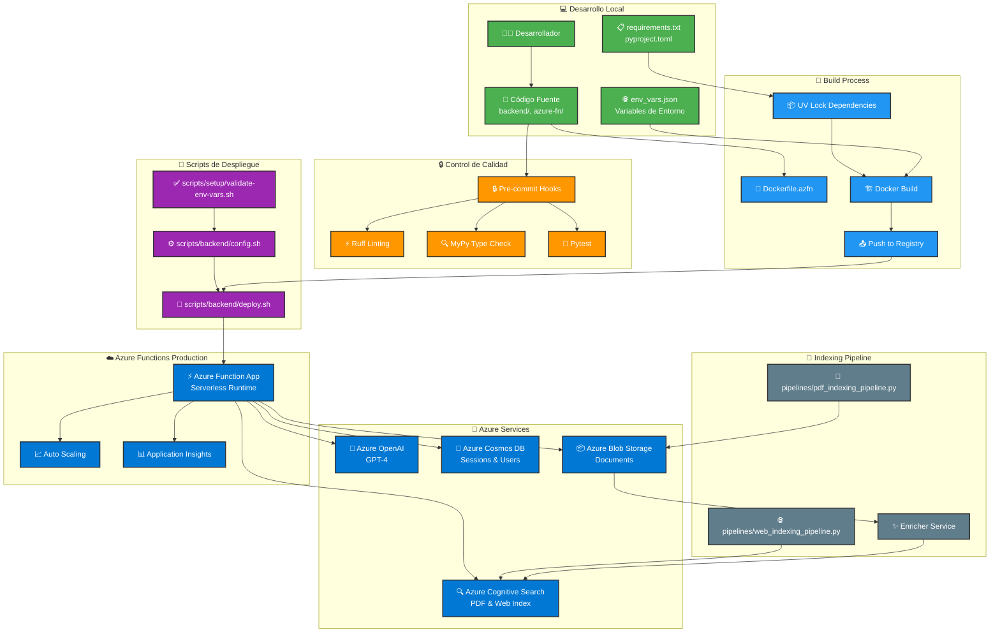

```mermaid
graph TB
    %% Desarrollo Local
    subgraph "💻 Desarrollo Local"
        DEV[👨‍💻 Desarrollador]
        CODE[📝 Código Fuente<br/>backend/, azure-fn/]
        ENV[🌐 env_vars.json<br/>Variables de Entorno]
        DEPS[📋 requirements.txt<br/>pyproject.toml]
    end
    
    %% Control de Calidad
    subgraph "🔒 Control de Calidad"
        PRE[🔒 Pre-commit Hooks]
        RUFF[⚡ Ruff Linting]
        MYPY[🔍 MyPy Type Check]
        TEST[🧪 Pytest]
    end
    
    %% Build y Containerización
    subgraph "🐳 Build Process"
        DOCKER[🐳 Dockerfile.azfn]
        UV[📦 UV Lock Dependencies]
        BUILD[🏗️ Docker Build]
        PUSH[📤 Push to Registry]
    end
    
    %% Scripts de Despliegue
    subgraph "📜 Scripts de Despliegue"
        CONFIG[⚙️ scripts/backend/config.sh]
        DEPLOY[🚀 scripts/backend/deploy.sh]
        VALIDATE[✅ scripts/setup/validate-env-vars.sh]
    end
    
    %% Azure Functions Production
    subgraph "☁️ Azure Functions Production"
        AZFN[⚡ Azure Function App<br/>Serverless Runtime]
        SCALE[📈 Auto Scaling]
        MONITOR[📊 Application Insights]
    end
    
    %% Servicios Azure Backend
    subgraph "🔵 Azure Services"
        OPENAI[🧠 Azure OpenAI<br/>GPT-4]
        SEARCH[🔍 Azure Cognitive Search<br/>PDF & Web Index]
        COSMOS[💾 Azure Cosmos DB<br/>Sessions & Users]
        BLOB[📦 Azure Blob Storage<br/>Documents]
    end
    
    %% Pipeline de Indexación
    subgraph "🔄 Indexing Pipeline"
        PDF_PIPE[📄 pipelines/pdf_indexing_pipeline.py]
        WEB_PIPE[🌐 pipelines/web_indexing_pipeline.py]
        ENRICH[✨ Enricher Service]
    end
    
    %% Flujo de Desarrollo
    DEV --> CODE
    CODE --> PRE
    PRE --> RUFF
    PRE --> MYPY
    PRE --> TEST
    
    %% Flujo de Build
    CODE --> DOCKER
    DEPS --> UV
    UV --> BUILD
    ENV --> BUILD
    BUILD --> PUSH
    
    %% Flujo de Despliegue
    VALIDATE --> CONFIG
    CONFIG --> DEPLOY
    PUSH --> DEPLOY
    DEPLOY --> AZFN
    
    %% Azure Functions Runtime
    AZFN --> SCALE
    AZFN --> MONITOR
    AZFN --> OPENAI
    AZFN --> SEARCH
    AZFN --> COSMOS
    AZFN --> BLOB
    
    %% Pipelines de Indexación
    PDF_PIPE --> BLOB
    WEB_PIPE --> SEARCH
    BLOB --> ENRICH
    ENRICH --> SEARCH
    
    %% Estilos
    classDef dev fill:#4CAF50,stroke:#333,stroke-width:2px,color:#fff
    classDef quality fill:#FF9800,stroke:#333,stroke-width:2px,color:#fff
    classDef build fill:#2196F3,stroke:#333,stroke-width:2px,color:#fff
    classDef deploy fill:#9C27B0,stroke:#333,stroke-width:2px,color:#fff
    classDef azure fill:#0078D4,stroke:#333,stroke-width:2px,color:#fff
    classDef pipeline fill:#607D8B,stroke:#333,stroke-width:2px,color:#fff
    
    class DEV,CODE,ENV,DEPS dev
    class PRE,RUFF,MYPY,TEST quality
    class DOCKER,UV,BUILD,PUSH build
    class CONFIG,DEPLOY,VALIDATE deploy
    class AZFN,SCALE,MONITOR,OPENAI,SEARCH,COSMOS,BLOB azure
         class PDF_PIPE,WEB_PIPE,ENRICH pipeline
```